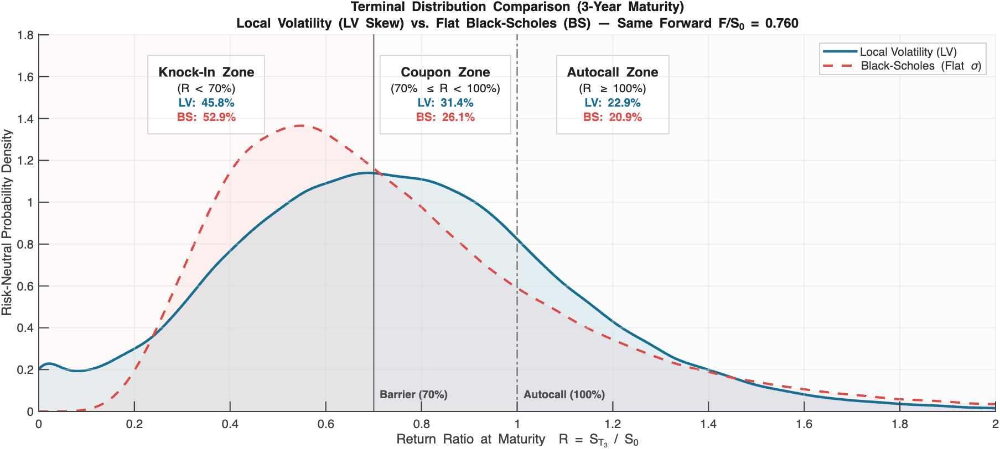

# Autocallable Reverse Convertible under Local Volatility

Final project, Financial Engineering (MSc Mathematical Engineering, Politecnico di Milano, 2025/26).
MATLAB. Full write-up: [Report.pdf](Report.pdf).

## Problem

A desk is short EUR 20M of a 3-year Knock-In Reverse Convertible on Intesa Sanpaolo. The note pays a memory coupon whenever the underlying is above 70% of the strike, redeems early if it is above 100%, and converts into stock if it ends below 70%. The payoff is therefore driven by digitals at 70% and 100%, plus discrete dividends over a three-year horizon.

Both features break the standard flat-volatility approach: digital prices depend on the slope of the smile, not on its level, and dividends on a single stock are discrete cash amounts, not a continuous yield.

## Approach

- Local volatility surface calibrated with a Reghai fixed-point iteration on the Dupire forward PDE, solved with an implicit finite-difference scheme under the Duffy change of variable `y = K/(K+S0)`.
- Discrete proportional dividends bootstrapped from Single Stock Dividend Futures, applied as jumps on a time grid anchored to the exact ex-dividend dates.
- Monte Carlo pricing of the certificate and of vanilla puts, with antithetic variates; Greeks by central differences under common random numbers.
- Four static hedging portfolios (spot, spot + dividend futures, + ATMF put, + a put chosen by L2 minimisation of the residual Greeks over the spot grid), with P&L attribution on two later market dates.

## Results

The par coupon comes out at 14.24% under local volatility against 15.34% under a flat ATM Black-Scholes. Quoting both models at the same coupon, the certificate is worth 100.16% of notional under local volatility and 96.29% under the flat one: pricing the note off a single volatility misprices it by 3.9% of notional and overstates the fair coupon by about 110 bp. The reason is visible in the terminal distribution below, where the skew lifts the probability of staying above the 70% coupon barrier from 47.0% to 54.2%.

Under this dividend framework the SSDF has zero delta and zero vega by construction (proof in the report), so dividend risk can be hedged in isolation.

On the second market date ISP fell 16.8% and dividend futures lost between 49% and 74%. The delta-only book lost EUR 2.18M; the fully hedged books lost between EUR 0.10M and 0.18M.



## Running it

```matlab
cd src
main
```

`main.m` reads the market data in `Project5_Autocallable/Market Data/` and runs calibration, pricing, risk and hedging. The Parallel Computing Toolbox is recommended.

## Authors

Group 5B: Stefano De Amici, Nassim Karimi, Alberto Toia. Advisors: Prof. Roberto Baviera, Alessandro Montinari.
