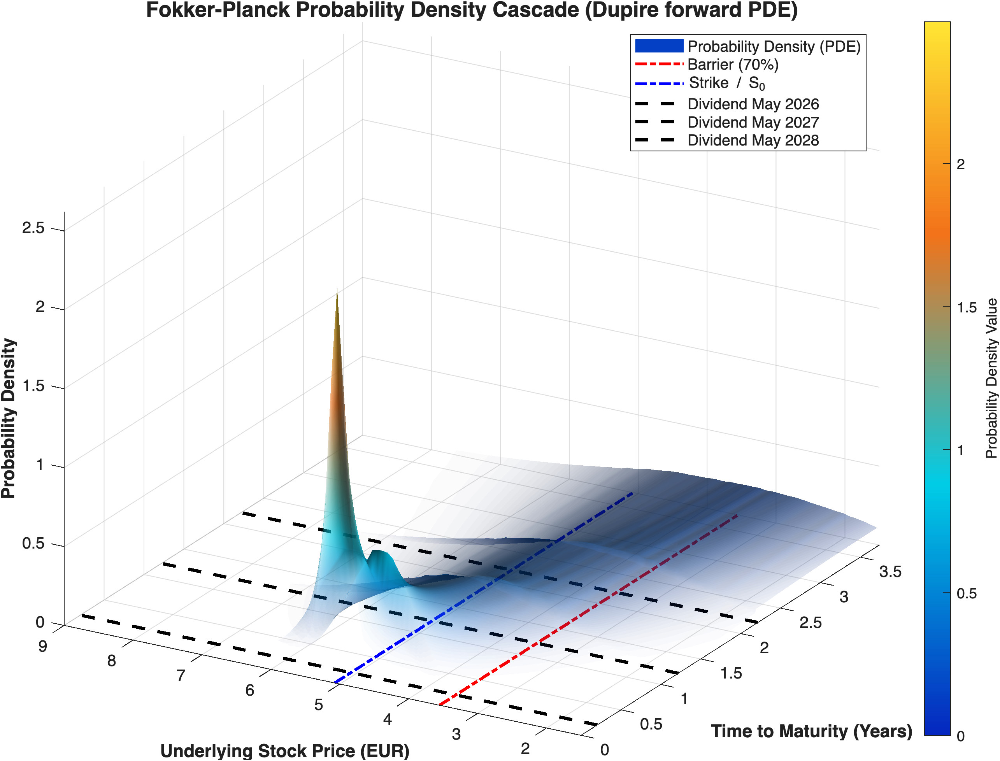
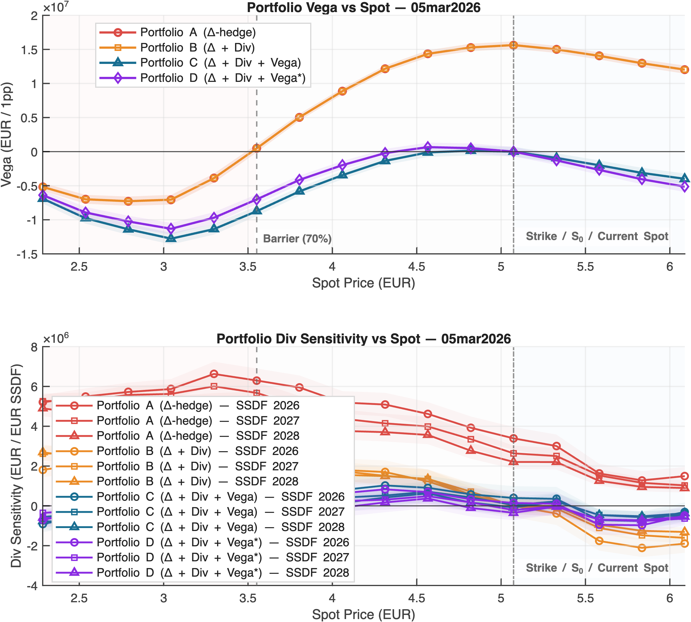

# Autocallable Reverse Convertible under Local Volatility

**Pricing, calibration and dividend-risk management of a 3Y Knock-In Reverse Convertible autocallable certificate on Intesa Sanpaolo (ISP IM).**


-555)


Final project for the *Financial Engineering* course (MSc Mathematical Engineering – Quantitative Finance, Politecnico di Milano, A.Y. 2025/2026).
A trading desk is **short EUR 20M** of the certificate and must price it consistently with the smile, isolate its dividend exposure and immunise the book.

📄 **[Full report (25 pages, PDF)](Report.pdf)**

---

## Headline results

| Question | Answer |
|---|---|
| What does the smile cost you? | Collapsing the skew onto a single ATM number **misprices the note by 3.9% of notional** (EUR 780k on the book) and inflates the par coupon by **110 bp** (15.34% BS vs 14.24% LV). |
| How fine must the LV grid be? | A node sweep over `N ∈ [17, 71]` clamps the calibration error below the 1 bp market tolerance from `N = 44`; **N = 56** is retained as the production setting, cutting **90 Monte Carlo runs (4.5M paths)** across the three valuation dates. |
| Can dividend risk be hedged cleanly? | Yes. Under a bootstrapped **discrete proportional** dividend framework, Single Stock Dividend Futures have **Δ ≡ 0 and Vega ≡ 0 by construction** (analytical proof in §6.5) — they are orthogonal instruments for pure dividend risk. |
| Do the hedges hold under stress? | On a real **−16.8% ISP sell-off with SSDFs down 49–74%**, the delta-only book loses EUR 2.18M (−10.9% of notional); the fully hedged books contain the loss to **EUR 0.10–0.18M (≈0.5–0.9%)**. |

---

## The product

Three-year Knock-In Reverse Convertible, issued at par (EUR 100,000 per security), on `R_t = S_t / S_0` observed annually at `t₁, t₂, t₃`:

| Mechanism | Dates | Condition | Payout |
|---|---|---|---|
| Memory "snowball" coupon | t₁, t₂, t₃ | `R ≥ 70%` | Coupon X% p.a. **plus** all accrued unpaid coupons |
| Autocall | t₁, t₂ | `R ≥ 100%` | Early redemption at par + that date's coupon |
| Final redemption | t₃ | `R ≥ 70%` | Par |
| Knock-in | t₃ | `R < 70%` | `N · R` — a discontinuous 30% drop |

Economically the note is a **portfolio of digitals** (coupon = digital at 70%, autocall = digital at 100%) plus a short maturity-only down-and-in put. Digital prices live on the *slope* of the smile — `digital(K) = digital_BS(K) − Vega · σ'(K)` — which is exactly why the flat benchmark fails.

---

## Method

### 1. Calibration — semi-parametric local volatility via the forward PDE

- Forward (dual Dupire / Fokker–Planck) equation solved for European calls with `r = q = 0`, Act/365.
- **Duffy change of variable** `y = K/(K+S₀) ∈ [0,1)` maps the semi-infinite strike domain onto a bounded interval; both PDE coefficients vanish at the endpoints, so Dirichlet BCs come *for free*.
- **Fully implicit backward-Euler** scheme, `N_y = N_t = 250`. Since `σ_LV` is time-independent the tridiagonal operator is assembled and LU-factorised **once** and reused — the dominant computational saving.
- **Non-uniform time grid** anchored on the exact ex-dividend dates, removing the `O(Δt)` timing bias of the dividend jump `C(K, τ⁺) = (1−d)·C(K/(1−d), τ⁻)`.
- **Reghai multiplicative fixed point**: `σ⁽ᵏ⁺¹⁾ = σ⁽ᵏ⁾ · I_logK[ IV_mkt / IV_mod⁽ᵏ⁾ ]`, interpolating the *ratio* (not σ) in log-strike; converges to a 1 bp tolerance.
- **Adaptive node placement**: five mandatory strikes (ATM = 100% autocall, ATMF, 70% barrier, `S_low`, `S_high`), remaining nodes allocated proportionally to the curvature of market implied variance in log-strike.
- Dividends are **discrete and proportional**, bootstrapped sequentially from SSDF market quotes (`d_i = SSDF_i / F_{i−1}`), so expected cash dividends stay locked to the market.

### 2. Pricing — Monte Carlo, LV vs flat Black–Scholes

- Log-Euler scheme with the Itô correction, so the discretised process stays a martingale; **antithetic variates**, 50,000 paths; MC time grid anchored on ex-dividend *and* observation dates.
- Engine validated on European puts (1Y/2Y/3Y, ATMF and 80%) against closed-form Black–Scholes: BS-MC matches BS-analytic to the second decimal (14.56% vs 14.57% on the 3Y ATMF put).
- Par coupon solved with `fzero` on `E^Q[Π(X)] = N`.

| | Par coupon | Certificate price (% notional) | 95% CI |
|---|---|---|---|
| **Local volatility** | **14.24%** | **100.16%** | [99.92, 100.39] |
| Flat ATM Black–Scholes | 15.34% | 96.29% | [96.07, 96.51] |

Under LV the survival probability at the coupon barrier is `Q(R ≥ 70%) = 54.2%` versus `47.0%` under the flat model — the skew thins the deep crash tail and lifts the bulk, and it is precisely that mass which the digital payoffs are paid on.

### 3. Risk management — Greeks, hedge design, P&L explain

- **Common Random Numbers** across base and bumped simulations, with central differences, driving the finite-difference variance down by orders of magnitude; **profile pinning** at `S₀` removes residual sampling noise on the spot grid.
- Standalone risk of the short book: Vega ≈ **+EUR 15.6M / 1pp** at `S₀`, flipping sign below the barrier; dividend sensitivity up to **EUR 6.5M per EUR of SSDF** (2026 tenor), peaking just below the barrier.
- Four static hedge portfolios of increasing sophistication:

| | Instruments | Purpose |
|---|---|---|
| **A** | ISP stock | Delta only |
| **B** | + SSDF (3 tenors) | Dividend neutral at `S₀` |
| **C** | + 3Y ATMF put | Parallel Vega neutral at `S₀` |
| **D** | + **optimal 110% put** | Vega **and** dividend residuals minimised in weighted L2 across the spot grid |

- Portfolio **D** selects the vanilla by minimising the lognormal-probability-weighted L2 norm of the net Greeks over the whole spot grid, not just at inception — a profile match rather than a point match.
- **P&L explain** on live market data at t₁ (+4.0% spot) and t₂ (−16.8% spot, SSDFs −49% to −74%), decomposed leg by leg, with bid-offer spreads (0.5% certificate / 0.2% stock / 0.1% SSDF / 0.01% vanilla).

| Net P&L (EUR) | A | B | C | D |
|---|---|---|---|---|
| t₁ gross | +155,738 | +62,929 | +65,452 | +62,209 |
| t₂ gross | **−2,177,298** | −100,892 | −167,199 | −178,132 |
| t₂ incl. spreads | −2,128,000 | −53,262 | −121,945 | −134,007 |

Residuals are second order by construction — gamma and vanna near the barrier — since the hedges are static and matched at inception.

---

## Figures

<p align="center">
  <br>
  <em>Transition density p(S,t) from the Fokker–Planck solver over the 3-year life of the note: diffusion of the initial Dirac spike, with the three discrete proportional dividend jumps visible as sharp leftward shifts of the whole distribution.</em>
</p>

<p align="center">
  <br>
  <em>Risk-neutral terminal law of R = S_T3/S_0 under the calibrated LV surface (solid) vs a flat BS volatility (dashed), same forward. The skew lifts the mass above the 70% coupon barrier — 54.2% vs 47.0% — which is exactly what the digital payoffs are paid on.</em>
</p>

<p align="center">
  <br>
  <em>Net Vega (top) and net dividend sensitivity (bottom) of the four hedged books across the spot grid. C and D are Vega-flat at S_0 by construction; away from it the optimised 110% put of Portfolio D tracks the certificate profile better than the textbook ATMF put.</em>
</p>

---

## Repository structure

```
.
├── Report.pdf                        # full write-up (25 pp.)
├── src/
│   ├── main.m                        # entry point: calibration → pricing → risk → hedging
│   ├── node_sweep.m                  # auxiliary study: N ∈ [17,71] trade-off analysis
│   ├── orchestrators/                # pipeline coordination, parallel over dates
│   └── helpers/
│       ├── data_loader/              # market data parsing, dividend bootstrap from SSDFs
│       ├── calibration/              # Fokker–Planck solver, Reghai fixed point, node selection
│       ├── pricing/                  # BS/LV path simulators, payoffs, par-coupon solver
│       ├── risk_management/          # Greeks (CRN), L2 vanilla optimiser, P&L attribution
│       └── reporting/                # console tables and plots
└── Project5_Autocallable/
    ├── Project 5.pdf                 # assignment specification
    └── Market Data/                  # ISP smile + SSDF quotes for 05, 06, 09 Mar 2026
```

Three structural layers: **control** (`src/`) → **orchestration** (`src/orchestrators/`) → **functional helpers** (`src/helpers/`), with a strictly downward dependency flow and a shared path-simulation DAG inside `compute_risk.m`.

## Running it

```matlab
cd src
main
```

`main.m` self-locates, adds `src/helpers/` to the path and reads the three market-data workbooks from `Project5_Autocallable/Market Data/`. The pipeline uses `parfor` across valuation dates and path batches — the **Parallel Computing Toolbox** is recommended (the code runs without it, serially).

## References

- A. Reghai, S. Boya, G. Vong (2012) — *Local volatility: smooth calibration and fast usage* (fixed-point calibration with discrete dividends).
- D. Duffy (2009) — ADE and exponential-fitting schemes (change of variable and implicit FD scheme).

## Authors

Group 5B — **Stefano De Amici**, **Nassim Karimi**, **Alberto Toia**.
Advisors: Prof. Roberto Baviera, Alessandro Montinari — Politecnico di Milano.

> Academic work. Market data are those provided with the course assignment; nothing here is investment advice.
